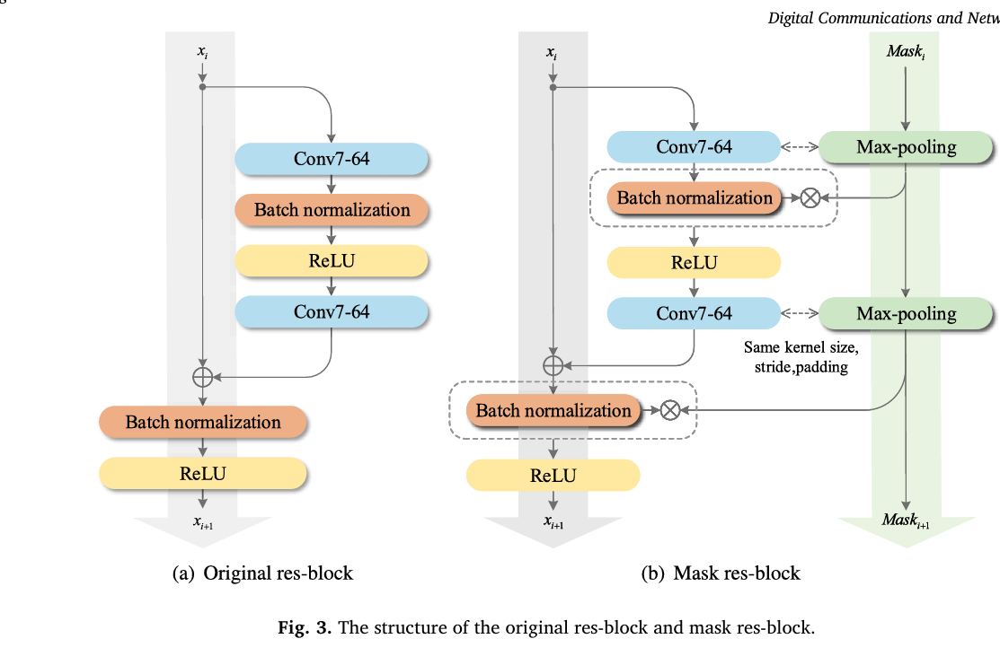
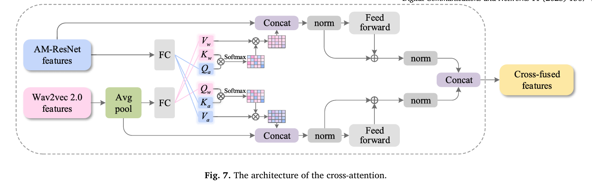
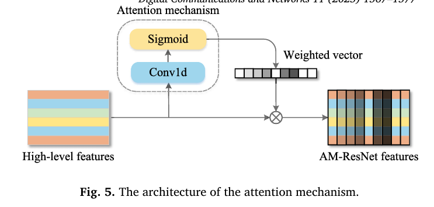
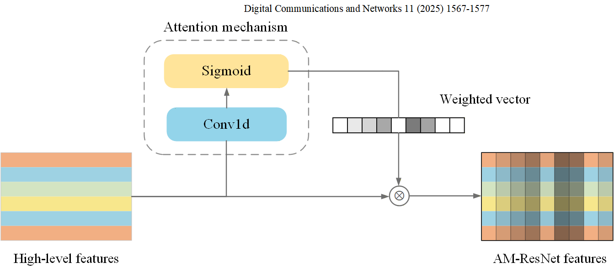
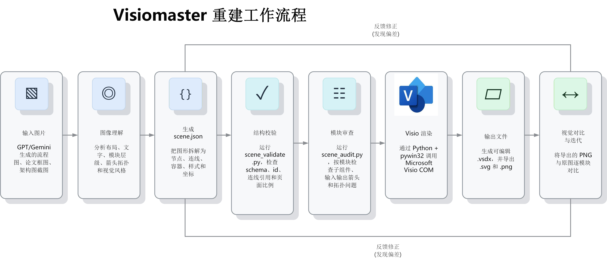

# Visiomaster

Visiomaster 是一个 Windows 优先的 Visio 图形重建工具包，同时也可以作为 Codex Skill 使用。它用来把 GPT、Gemini 等 AI 生成的流程图/学术示意图，以及已有的流程图、架构图、论文模块图重建为可编辑的 Microsoft Visio 图纸。

它的目标不是把原图贴进 Visio，而是把主要结构拆成真正的 Visio 形状、文字和连接线，最终输出可继续编辑的 `.vsdx`，同时导出 `.svg` 和 `.png` 便于检查和展示。

本项目的流程设计参考了 `ppt-master` 的思路：先做图像理解、结构拆解和风格分析，再通过稳定的中间描述文件驱动确定性的渲染脚本。不同之处在于，Visiomaster 的最终目标不是 PPT 页面，而是可编辑的 Visio 图纸。

## 能做什么

- 输出可编辑的 `.vsdx`
- 导出高质量 `.svg`
- 导出预览 `.png`
- 生成可选的模块级 `.audit.md` 审查清单
- 将论文中的流程框图、模型结构图、AI 生成的学术示意图转成可编辑 Visio 图

核心流程：

```text
原始图片 -> scene.json -> 结构校验 -> 模块审查 -> Visio COM 渲染 -> vsdx/svg/png -> 视觉对比 -> 迭代修正
```

典型场景包括：

- 复刻论文中的模型结构图、流程图、消融模块图
- 将 Gemini、GPT Image 等图像生成模型产出的学术框图整理为可编辑 Visio
- 把已有截图重建为可维护的 `.vsdx`，方便后续改字、改线、换配色和投稿排版

## 效果示例

以下示例展示“参考图 -> Visiomaster 重建图”的效果。重建结果来自可编辑 Visio 图纸导出的 PNG，而不是整张贴图。

| 参考图 | Visiomaster 重建图 |
| --- | --- |
|  |  |
|  |  |
|  |  |

更多说明见 [docs/gallery.md](docs/gallery.md)。

## 环境要求

- Windows
- 已安装 Microsoft Visio 桌面版
- Python 3.10+
- `requirements.txt` 中的 Python 依赖

安装依赖：

```powershell
python -m pip install -r requirements.txt
```

你可以使用系统 Python、venv 或 conda 环境；只要该环境能导入 `pywin32`，并且可以访问本机安装的 Visio COM 应用即可。

可以先运行一次环境自检：

```powershell
python .\scripts\check_visio_env.py
```

自检会尝试启动 Visio、创建一个极简图纸、保存 `.vsdx`，并导出 `.png`/`.svg`。如果这一步失败，说明当前机器的 Visio COM 或导出环境还需要先修好。

## 使用方式

Visiomaster 有两种主要用法：

- 直接作为 CLI 工具使用：手写或生成 `scene.json`，然后用 `scripts/` 下的 Python 脚本校验、审查和渲染。
- 作为 AI 编程助手的技能/上下文使用：Codex、Claude Code 或其他本地代理都可以读取 `SKILL.md`、引用 `scene.json` 规范，并调用同一套脚本。

真正的硬性要求不是 Codex，而是渲染阶段需要 Windows、Python、`pywin32` 和本机 Microsoft Visio 桌面版。

## 作为 Codex Skill 安装

把本仓库克隆或复制到 Codex 的 skills 目录：

```powershell
git clone https://github.com/<owner>/visiomaster.git "$env:USERPROFILE\.codex\skills\visiomaster"
cd "$env:USERPROFILE\.codex\skills\visiomaster"
python -m pip install -r requirements.txt
```

之后在 Codex 里使用 `$visiomaster`，即可触发“图片到可编辑 Visio”的重建流程。

## 作为普通 CLI 工具使用

如果不使用 Codex，也可以直接克隆仓库并运行脚本：

```powershell
git clone https://github.com/<owner>/visiomaster.git visiomaster
cd visiomaster
python -m pip install -r requirements.txt
```

之后按 `scene.json` 规范准备场景文件，再执行校验、审查和渲染命令即可。Claude Code 这类本地 AI 编程工具也可以按这种方式调用，只要它运行在同一台装有 Visio 的 Windows 机器上。

## 快速开始

校验一个示例 scene：

```powershell
python .\scripts\scene_validate.py .\templates\examples\basic_flow.scene.json
```

生成模块级审查报告：

```powershell
New-Item -ItemType Directory .\exports -Force | Out-Null
python .\scripts\scene_audit.py .\templates\examples\audit_region.scene.json --output .\exports\audit_region.audit.md
```

渲染为 Visio 并导出：

```powershell
python .\scripts\scene_to_visio.py .\templates\examples\basic_flow.scene.json --output-dir .\exports --basename basic_flow
```

从图片生成一个起始版 `scene.json`：

```powershell
python .\scripts\image_to_scene.py --image C:\path\source.png --template basic-flow --output .\work\scene.json
```

注意：`image_to_scene.py` 只是起始场景生成器，不是全自动精确复刻引擎。复杂图仍然需要人工或 AI 辅助调整 `scene.json`，再经过校验、审查、渲染和对比。

## 工作流程



更详细的流程说明见 [docs/workflow.md](docs/workflow.md)。

## Scene 模型

`scene.json` 是图像分析和 Visio 渲染之间的中间协议。它描述页面尺寸、节点、连线、样式、资源和复刻元数据。

重要参考：

- [references/scene-schema.md](references/scene-schema.md)：`scene.json` 字段、坐标规则、保真元数据
- [references/visio-component-map.md](references/visio-component-map.md)：支持的组件和渲染意图
- [references/visio-export-flow.md](references/visio-export-flow.md)：Visio COM 导出流程和排错
- [templates/visio_components.json](templates/visio_components.json)：支持的组件词表
- [templates/style_profiles.json](templates/style_profiles.json)：视觉风格配置

## 组件策略

Visiomaster 使用受控的语义组件词表，而不是直接暴露所有 Visio stencil。这样可以减少不同 Office 语言、版本和模板名称带来的不稳定性。

常见节点类型：

- `process_box`、`rounded_process`、`decision_diamond`、`terminator`
- `group_container`、`audit_region`、`boundary_port`
- `feature_map_grid`、`feature_map_banded`、`grid_matrix`
- `operator_node`、`merge_bus`、`junction_point`、`bracket`
- `classifier_head`、`wave_signal`、`text_block`、`image_tile`

常见连线类型：

- `arrow_connector`、`dynamic_connector`、`line_segment`
- `join_connector`、`fork_connector`、`boundary_arrow`
- `residual_connector`、`residual_loop`

## 为什么需要审查区域

复杂图经常会“整体看着像”，但局部出错：模块偏移、箭头指错、边界输出缺失、算子没有居中、某条线被 Visio 自动吸附到了错误组件。

因此推荐使用：

- `group_container`：表示原图中可见的模块边框
- `audit_region`：表示不可见的逻辑审查区域，适用于原图没有虚线框但仍然需要分模块检查的情况

`scene_audit.py` 会把二者都当作模块进行审查，输出子组件、内部连线、输入连线、输出连线和拓扑风险提示。

## 仓库结构

```text
visiomaster/
├── SKILL.md
├── agents/openai.yaml
├── scripts/
│   ├── image_to_scene.py
│   ├── scene_validate.py
│   ├── scene_audit.py
│   ├── scene_to_visio.py
│   ├── check_visio_env.py
│   └── enumerate_visio_masters.py
├── references/
├── templates/
│   ├── visio_components.json
│   ├── style_profiles.json
│   └── examples/
├── docs/
│   ├── workflow.md
│   ├── gallery.md
│   └── assets/
├── requirements.txt
└── README.md
```

## 当前限制

- 渲染阶段依赖 Windows 和 Microsoft Visio 桌面版。
- macOS/Linux 可以编辑 `scene.json`，但不能通过 Visio COM 渲染。
- `image_to_scene.py` 只能生成起始场景，不保证自动复刻准确。
- 1:1 精确复刻需要多轮视觉对比和局部修正。
- 本机 Visio stencil 名称会受到 Office 版本和语言影响。`enumerate_visio_masters.py` 主要用于研究本机组件，不建议把大量本地 stencil 名称硬编码进 scene。

## 兼容性说明

Visiomaster 当前主要在作者本机的 Windows + Microsoft Visio 桌面版 + `pywin32` 环境中验证。由于 Visio COM、Office 版本、系统语言、默认 stencil 名称和导出行为都可能存在差异，其他机器或其他 Visio 版本上可能需要少量适配或调试。

本项目更适合作为“论文框图/流程图到可编辑 Visio”的工作流和脚本起点，而不是已经覆盖所有 Visio 版本的通用商业级转换器。如果你在其他版本的 Visio 上遇到 COM 启动、stencil 查找、导出 PNG/SVG 或连线渲染差异，欢迎通过 issue 反馈环境和复现样例。

示例中的参考图仅用于说明重建任务和效果对比。公开使用时请确保示例图片来源合规；如果不确定论文截图或第三方图片的授权，建议替换为自制图、AI 生成图或明确可公开使用的示例图。
