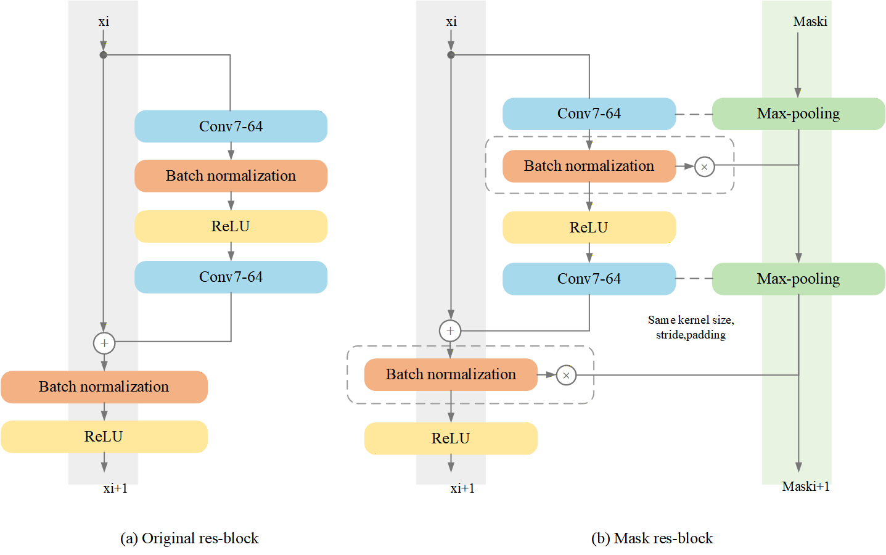
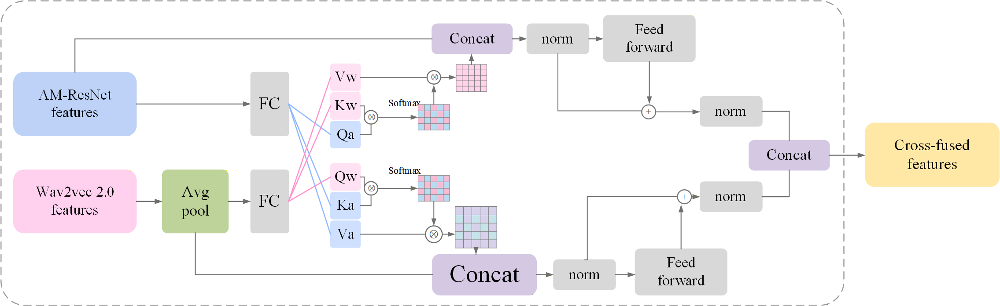

# 效果示例

本页展示 Fig4Visio 对论文类流程框图、模型结构图和注意力模块图的复刻效果。

这些示例遵循同一个流程：

```text
参考图 -> scene.json -> validate -> audit -> Visio 渲染 -> 导出 PNG/SVG/VSDX
```

重建图不是原图贴图，而是由 `scene.json` 驱动生成的可编辑 Visio 形状、文本和连接线。示例中的参考图仅用于说明重建任务和效果对比。

> 兼容性说明：这些示例在作者本机的 Windows + Microsoft Visio 桌面版 + `pywin32` 环境中生成。不同 Visio/Office 版本、系统语言和 COM 导出行为可能导致输出略有差异。

> 图片说明：参考图仅用于展示复刻任务和效果对比。公开仓库中使用第三方论文截图时，请确认图片授权；如不确定，建议替换为自制或 AI 生成的示例图。

## Mask Res-block

| 参考图 | Fig4Visio 重建图 |
| --- | --- |
|  |  |

对应 scene 文件：

[templates/examples/paper_figures/mask_res_block.scene.json](../templates/examples/paper_figures/mask_res_block.scene.json)

## Cross-attention

| 参考图 | Fig4Visio 重建图 |
| --- | --- |
|  |  |

对应 scene 文件：

[templates/examples/paper_figures/cross_fused_features.scene.json](../templates/examples/paper_figures/cross_fused_features.scene.json)

## Attention Mechanism

| 参考图 | Fig4Visio 重建图 |
| --- | --- |
|  |  |

对应 scene 文件：

[templates/examples/paper_figures/attention_mechanism.scene.json](../templates/examples/paper_figures/attention_mechanism.scene.json)

## 适合的使用场景

- 学术论文中的模型结构图复刻
- AI 生成框图的 Visio 化整理
- 论文投稿前的图形重绘和统一风格
- 需要后续手动微调的流程图、模块图、架构图

## 注意

复杂图一般需要多轮修正。`scene_validate.py` 用于检查结构和连线引用，`scene_audit.py` 用于按模块审查局部拓扑，最终仍应对照参考图逐块检查。
