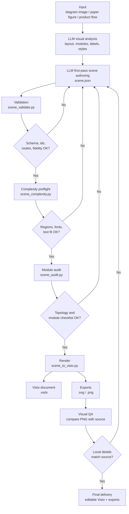
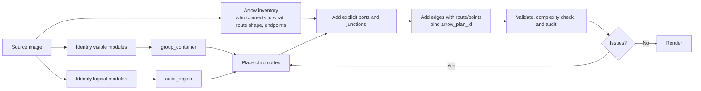
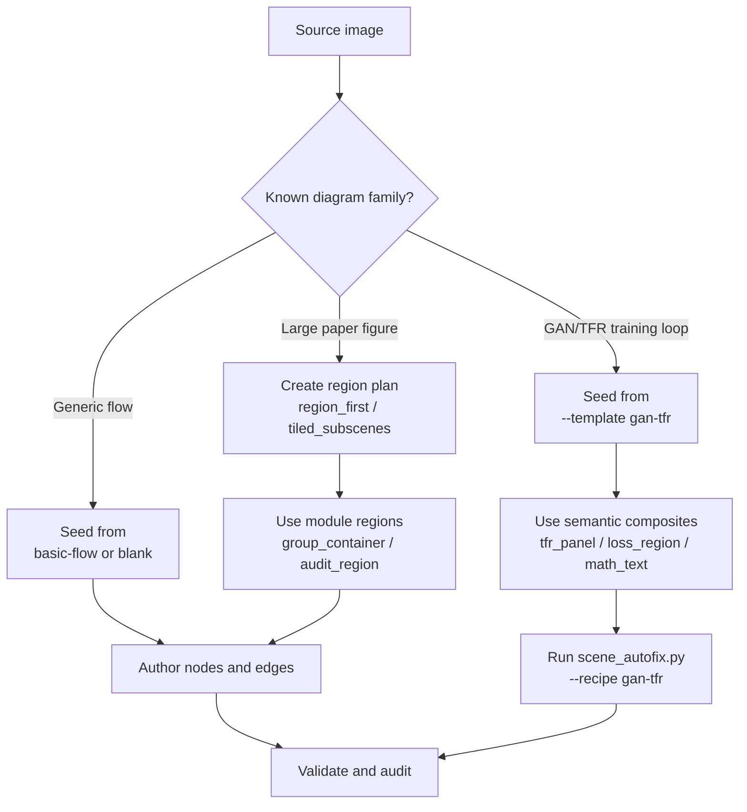
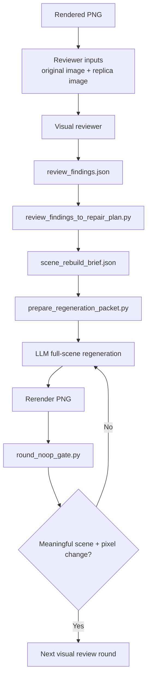

# Fig4Visio Workflow

This document describes the reconstruction loop used by Fig4Visio.

## Overall Flow



## Scene Authoring Loop



Use `group_container` when the source has a visible module boundary. Use `audit_region` when the source has no visible boundary but the figure still needs local review, such as a residual block, classifier head, attention module, or feature extraction lane.

`image_to_scene.py` is not a vision parser. It only creates a starter scene shell. The real first-pass scene must still be authored by the LLM from the source image.

For strict replicas, arrow topology is locked before the first render. The visual analysis step should write `metadata.arrow_plan` with one entry per source-visible arrow: source endpoint, target endpoint, `semantic_intent`, `route_shape`, line style, arrowhead, and certainty. Scene edges then reference those facts with `arrow_plan_id`. `scene_validate.py --strict` fails missing plan entries, unbound visible edges, wrong route shapes, diagonal drift on axis-locked arrows, fragmented feedback paths, and loop arrows that are not represented as one continuous `loop_arrow`.

## Generation-First Loop

For recurring paper-figure families, generation-first bootstrap is allowed for draft/clean exploration. It is not valid strict-replica proof. When the goal is exact capability evaluation, begin from a blank source-driven scene and fill `source_visual_inventory` / `region_plan` first.



The GAN/TFR template is meant to answer the "can it be drawn in one pass?" bootstrap problem. It starts with `tfr_panel`, `loss_region`, smooth `loop_arrow` plus terminal tangent points, clean `loss_region -> target` feedback stubs, `dashed_feedback_path`, `math_text`, and bundled backprop grammar, so the first draft render does not rely on later manual correction of broken outer loops, false dashed boxes, loose TFR labels, reversed arrows, or dashed paths through text.

Use this command when the source resembles a GAN/TFR training-cycle figure:

```powershell
python scripts/image_to_scene.py --image <source.png> --template gan-tfr --output <scene.json>
python scripts/scene_autofix.py <scene.json> --recipe gan-tfr --output <fixed.scene.json>
```

For draft/bootstrap or legacy scenes, run the same recipe once before rendering. If it rewrites local grammar, continue from the fixed scene and discard the old local subsystem instead of tuning its coordinates.

`scene_to_visio.py` no longer runs the GAN/TFR autofix implicitly for exact/strict scenes. Use `--autofix-gan-tfr` only when you explicitly want the bootstrap helper path. When it rewrites local grammar it writes `<basename>.autofixed.scene.json` into the export directory and renders that fixed scene. That file is a rewritten bootstrap scene, not final strict-replica evidence.

`scene_to_visio.py` then runs the rebuild gate automatically for exact-replica and GAN/TFR scenes. If `scene_audit.py --fail-on-rebuild` still finds local grammar failures, export stops before Visio opens. This is intentional: a scene with outer-loop cropping, compact `Ladv/Lrec` formulas, false dashed arrow fragments, or feedback arrows pointing into TFR input panels should be rebuilt before any PNG/SVG is produced.

## Review To Rebuild Loop

Visual QA is not complete when pair/crop/overlay images exist. The actionable loop is: original image, current replica, visual review, then a fresh full-scene rebuild.



Use `scripts/make_review_assets.py --write-review-bundle` only to package the round and optional human-debug assets. The reviewer itself should still see only the original and replica images. The bundle emits:

- `*_review_manifest.json`
- `*_review_findings.template.json`
- `*_scene_rebuild_brief.template.json`

The reviewer should receive only the source image and the replica image. It should return a filled `review_findings.json`, not free-form prose and not patch instructions.

Use the fixed reviewer prompt in `references/reviewer-two-image-prompt.md`.

Turn findings into a full-scene rebuild brief:

```powershell
python scripts/review_findings_to_repair_plan.py review_findings.json --scene scene.json --manifest review_manifest.json --output scene_rebuild_brief.json
```

Prepare the next full-scene regeneration packet:

```powershell
python scripts/prepare_regeneration_packet.py scene_rebuild_brief.json --output-dir review_round_02
```

If the script cannot recover both reviewer image paths, stop and repair the review bundle first. Do not continue with a half-specified rebuild handoff.

Then regenerate the whole scene. Do not patch the prior scene, do not choose among local repair modes, and do not reuse the old geometry as a scaffold. The rebuild packet is the handoff artifact for that next LLM authoring pass.

Use the fixed regeneration prompt in `references/full-scene-regeneration-prompt.md`.

After the regenerated render, enforce the round no-op gate:

```powershell
python scripts/round_noop_gate.py `
  --before-scene round_01.scene.json `
  --after-scene round_02.scene.json `
  --before-png round_01.png `
  --after-png round_02.png `
  --rebuild-brief review_round_02\scene_rebuild_brief.json
```

If this gate fails, the round did not meaningfully change the replica. Do not count it as a valid optimization round.

## Quality Gates

```mermaid
flowchart TD
  A["Validation gate"] --> A1["JSON loads"]
  A --> A2["Node and edge ids resolve"]
  A --> A3["Supported component types"]
  A --> A4["Route-quality warnings"]
  A --> A5["Exact-mode aspect ratio"]

  B["Complexity gate"] --> B1["Region coverage"]
  B --> B2["Dense-region warnings"]
  B --> B3["Font scale drift"]
  B --> B4["Text-fit risks"]
  B --> B5["Node overlap risks"]

  C["Audit gate"] --> C1["Module child count"]
  C --> C2["Incoming/outgoing edges"]
  C --> C3["Internal topology"]
  C --> C4["Boundary ports and fanout"]
  C --> C5["Cross-container bridges"]
  C --> C6["Typography Review<br/>resolved fonts and fallbacks"]

  D["Visual QA gate"] --> D1["Canvas ratio"]
  D --> D2["Container bounds"]
  D --> D3["Arrow grammar"]
  D --> D4["Special shapes/operators"]
  D --> D5["Feature map coloring"]
```



## Practical Rule

Do not judge complex reconstructions only by whole-image similarity. Review each module independently, because the most common failures are local: slightly shifted nodes, diagonal arrows where the source is horizontal, a connector glued to the wrong component, or a boundary output drawn from an internal block.

## Authoring Vs Reauthoring

Keep these as separate jobs:

1. `scene authoring`
   - visual source inventory
   - region split
   - component choice
   - topology first pass
   - first renderable scene

2. `scene reauthoring`
   - source + replica + structured review findings
   - ignore prior scene geometry
   - rebuild a fresh full scene
   - prove that the new scene actually changed the rendered output

Do not let failed reviews drift into incremental JSON surgery. The second round should be a new scene, not a patched scene.

## Convergence Order

For exact or strict-replica work, keep the repair order fixed:

1. Check whether the component choice is wrong.
2. Check whether local topology or trunk/boundary syntax is wrong.
3. Fix math text and rotated text.
4. Fix container/title/content proportions and internal density.
5. Only then fix gradients, shadows, line width, dash rhythm, and other finish details.

If the same local area still looks wrong after two micro-adjustment rounds, default to one of these root causes:
- wrong component choice
- wrong topology grammar
- renderer rule missing for that component family

Do not keep nudging the whole figure when the defect is local and structural.

## Full Rebuild Default

After review, the default action is always a full-scene rebuild.

Why this is the default:

- the first scene already came from LLM visual reasoning
- patching old geometry tends to preserve the first-round errors
- a "small fix" can still be recovered by a fresh scene when the reviewer describes the visual difference clearly
- repeated patch rounds often change metadata or tiny numbers without changing the rendered PNG

Region names such as `input_left`, `center_junction`, `consensus_top`, `private_bottom`, and `output_right` are still useful in findings. They help the next full-scene authoring pass focus attention, but they do not change the rebuild policy: regenerate the full scene anyway.

## Issue Buckets

Use one diagnosis per defect before editing:

- Component problem: the visual family is wrong even if coordinates are close, such as thick cuboids instead of thin slabs.
- Topology problem: the source shows a shared trunk/merge/boundary path, but the scene uses loose direct edges.
- Text problem: the label role, baseline, math attachment, rotation, or shrink behavior is wrong.
- Style problem: line weight, rounding, padding, density, dash rhythm, gradient, or shadow is wrong after structure is already correct.

## Exact Rules

For strict replica work, keep these as hard blockers:

- broken vertical strip text
- wrong or missing subscript / hat / Greek math glyph
- line-through-text
- long cross-module lines with implicit center-to-center anchors
- long paper-flow lines that stay diagonal
- concat/operator symbols rendered with the wrong component family
- repeated strip / panel / tensor geometry left on hidden defaults instead of explicit scene contract
- template-seeded starts presented as final capability evidence
- recipe/autofix-rewritten exact scenes presented as fresh authoring
- review assets that lack source-bound region_plan crops

Author local structure in this order:

1. split the figure into fixed review regions: global, input, core, output, arrow-dense, small-text, and caption when present
2. choose semantic component families first: tensor mode, repeated-strip module, operator mark, concat mark, bus/trunk/junction
3. lock cross-module anchors with boundary ports, buses, or explicit side anchors
4. lock text role and math/rotated-text policy
5. only then tune density, rounding, shadows, gradients, and fine offsets

For exact review assets, run `make_review_assets.py --scene <scene.json>`. The scene must provide source-bound region crops through `metadata.region_plan`; fixed named crops are supplemental only.

For large figures, run `scene_complexity.py` before Visio rendering. It catches the earlier failure layer: too few regions, nodes outside any region, over-dense modules, inconsistent font scale, likely text overflow, and node overlap.

For exact replicas with mixed typography, run `font_inventory.py` before final authoring and review the `Typography Review` section in `scene_audit.py`:

```powershell
python scripts/font_inventory.py --check "Times New Roman" --check "Cambria Math" --check "Calibri" --check "Microsoft YaHei UI"
python scripts/scene_audit.py <scene.json>
```

Use `source_font_family` when the source font is known, `font_family_candidates` when it is uncertain, and `font_role` when only the visual category is known. A font mismatch can change text width, line breaks, and perceived alignment, so fix it before coordinate polishing.
