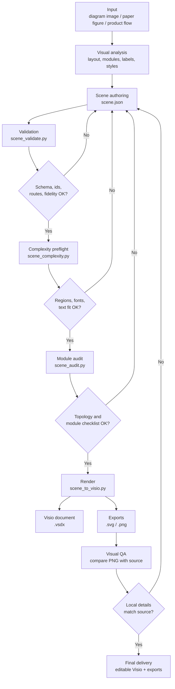
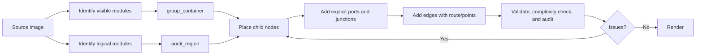
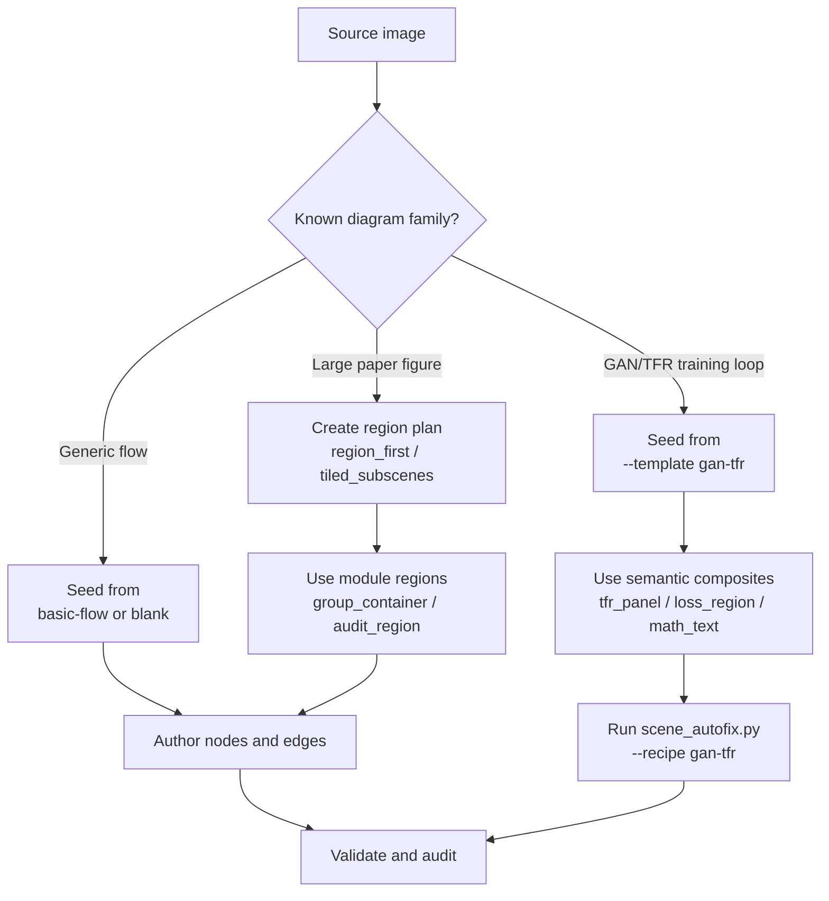

# Visiomaster Workflow

This document describes the reconstruction loop used by Visiomaster.

## Overall Flow



## Scene Authoring Loop



Use `group_container` when the source has a visible module boundary. Use `audit_region` when the source has no visible boundary but the figure still needs local review, such as a residual block, classifier head, attention module, or feature extraction lane.

## Generation-First Loop

For recurring paper-figure families, do not begin from a blank canvas when the topology is already known. Pick the closest first-pass template and recipe before manual scene authoring:



The GAN/TFR template is meant to answer the "can it be drawn in one pass?" problem. It starts with `tfr_panel`, `loss_region`, smooth `loop_arrow` plus terminal tangent points, clean `loss_region -> target` feedback stubs, `dashed_feedback_path`, `math_text`, and bundled backprop grammar, so the first render does not rely on later manual correction of broken outer loops, false dashed boxes, loose TFR labels, reversed arrows, or dashed paths through text.

Use this command when the source resembles a GAN/TFR training-cycle figure:

```powershell
python scripts/image_to_scene.py --image <source.png> --template gan-tfr --output <scene.json>
python scripts/scene_autofix.py <scene.json> --recipe gan-tfr --output <fixed.scene.json>
```

For legacy scenes, run the same recipe once before rendering. If it rewrites local grammar, continue from the fixed scene and discard the old local subsystem instead of tuning its coordinates.

`scene_to_visio.py` now runs the GAN/TFR autofix once by default before the rebuild gate. When it rewrites local grammar it writes `<basename>.autofixed.scene.json` into the export directory and renders that fixed scene. This gives first-pass generation a deterministic recovery path for compact formulas, dashed feedback fragments, loss-region stubs, reversed GAN arrows, and backprop bundles.

`scene_to_visio.py` then runs the rebuild gate automatically for exact-replica and GAN/TFR scenes. If `scene_audit.py --fail-on-rebuild` still finds local grammar failures, export stops before Visio opens. This is intentional: a scene with outer-loop cropping, compact `Ladv/Lrec` formulas, false dashed arrow fragments, or feedback arrows pointing into TFR input panels should be rebuilt before any PNG/SVG is produced.

## Quality Gates

```mermaid
flowchart TD
  A["Validation gate"] --> A1["JSON loads"]
  A --> A2["Node and edge ids resolve"]
  A --> A3["Supported component types"]
  A --> A4["Route-quality warnings"]
  A --> A5["Exact-mode aspect ratio"]

  B["Complexity gate"] --> B1["Region coverage"]
  B --> B2["Dense-region warnings"]
  B --> B3["Font scale drift"]
  B --> B4["Text-fit risks"]
  B --> B5["Node overlap risks"]

  C["Audit gate"] --> C1["Module child count"]
  C --> C2["Incoming/outgoing edges"]
  C --> C3["Internal topology"]
  C --> C4["Boundary ports and fanout"]
  C --> C5["Cross-container bridges"]
  C --> C6["Typography Review<br/>resolved fonts and fallbacks"]

  D["Visual QA gate"] --> D1["Canvas ratio"]
  D --> D2["Container bounds"]
  D --> D3["Arrow grammar"]
  D --> D4["Special shapes/operators"]
  D --> D5["Feature map coloring"]
```



## Practical Rule

Do not judge complex reconstructions only by whole-image similarity. Review each module independently, because the most common failures are local: slightly shifted nodes, diagonal arrows where the source is horizontal, a connector glued to the wrong component, or a boundary output drawn from an internal block.

For large figures, run `scene_complexity.py` before Visio rendering. It catches the earlier failure layer: too few regions, nodes outside any region, over-dense modules, inconsistent font scale, likely text overflow, and node overlap.

For exact replicas with mixed typography, run `font_inventory.py` before final authoring and review the `Typography Review` section in `scene_audit.py`:

```powershell
python scripts/font_inventory.py --check "Times New Roman" --check "Cambria Math" --check "Calibri" --check "Microsoft YaHei UI"
python scripts/scene_audit.py <scene.json>
```

Use `source_font_family` when the source font is known, `font_family_candidates` when it is uncertain, and `font_role` when only the visual category is known. A font mismatch can change text width, line breaks, and perceived alignment, so fix it before coordinate polishing.
