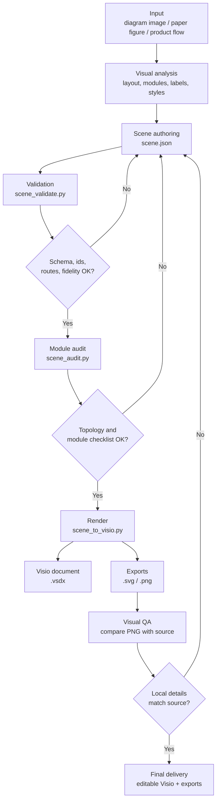
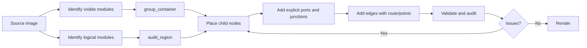

# Visiomaster Workflow

This document describes the reconstruction loop used by Visiomaster.

## Overall Flow

## Scene Authoring Loop

Use `group_container` when the source has a visible module boundary. Use `audit_region` when the source has no visible boundary but the figure still needs local review, such as a residual block, classifier head, attention module, or feature extraction lane.

## Quality Gates

```mermaid
flowchart TD
  A["Validation gate"] --> A1["JSON loads"]
  A --> A2["Node and edge ids resolve"]
  A --> A3["Supported component types"]
  A --> A4["Route-quality warnings"]
  A --> A5["Exact-mode aspect ratio"]

  B["Audit gate"] --> B1["Module child count"]
  B --> B2["Incoming/outgoing edges"]
  B --> B3["Internal topology"]
  B --> B4["Boundary ports and fanout"]
  B --> B5["Cross-container bridges"]

  C["Visual QA gate"] --> C1["Canvas ratio"]
  C --> C2["Container bounds"]
  C --> C3["Arrow grammar"]
  C --> C4["Special shapes/operators"]
  C --> C5["Feature map coloring"]
```

## Practical Rule

Do not judge complex reconstructions only by whole-image similarity. Review each module independently, because the most common failures are local: slightly shifted nodes, diagonal arrows where the source is horizontal, a connector glued to the wrong component, or a boundary output drawn from an internal block.
